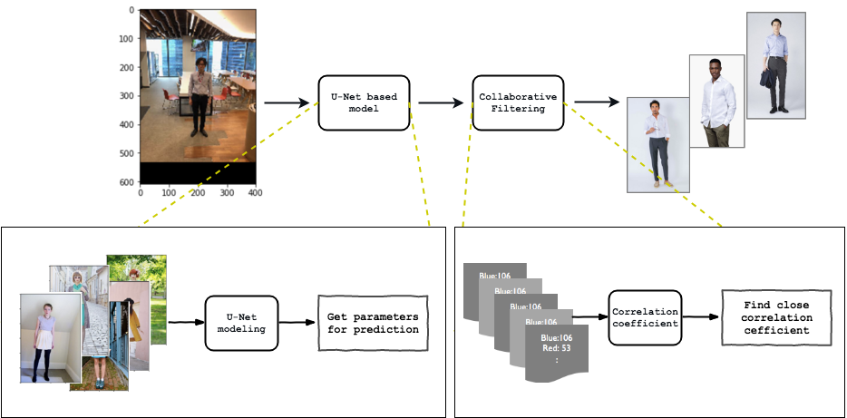
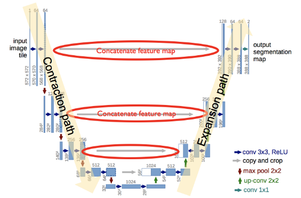
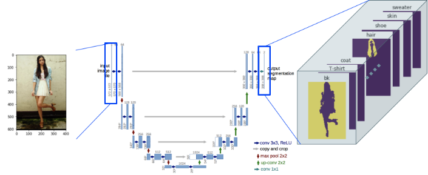
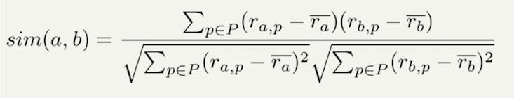
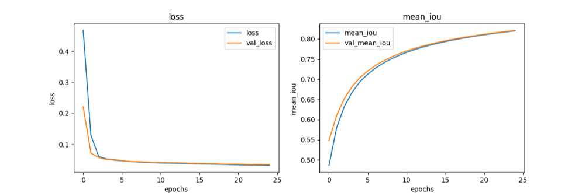

# U-Net and Collaborative filtering on fashion parsing and recommendation
---

## Project description
---
### Overview
This project is to create models and processes to provide similar fashion style with user's own picture. My goal is to train model that can explore and share similar picutres to users. 




### What this project uses

__U-Net__

I think everyone knows what kind of model U-Net is. So I only shares basic U-Net image with few comments I saw useful. 



In this project, I wants to classify multiple fashion categories like shirts, skirt, scarf, etc. Thus we modify basic U-Net model and train it. The image will be like below. 




__Correlation Coefficient__




### References
Without following assets, I could not create this prototype. Again thank you very much all owners and authers.

- Traning set

[Fashion Parsing with Weak Color-Category Labels](https://sites.google.com/site/fashionparsing/home)

This dataset is so common that you can see in many papers and articles. This is the publicly available dataset of pictures(female model) and pixel-level categories such as fashion category and color category. If you use this first time, you will be excited. I was feeling like a real ML engineer.

- Reference 1: Papers

[Multi-Class U-Net for Segmentation of Non-Biometric Identifiers](https://www.fer.unizg.hr/_download/repository/IMVIP_2017_HrkacBrkicKalafatic.pdf)

- Reference 2: Books

Work in progress.

- Reference 3: Web sites

[Semantic Image Segmentation with DeepLab in TensorFlow](https://github.com/tensorflow/models/blob/master/research/deeplab/deeplab_demo.ipynb)

This is Google AI Blog. I was so fascinated and mesmerized by this blog and source code. I again realized Google has a lot of great engineers in their team. 

[C4W1L06 Convolutions Over Volumes](https://youtu.be/KTB_OFoAQcc?list=PLkDaE6sCZn6Gl29AoE31iwdVwSG-KnDzF&t=166)

I love Professor Ng!. I learnt CNN in a structured manner with his videos.


## Getting started, example
---

__Traning set__

[This dataset](https://sites.google.com/site/fashionparsing/home) is so common that you can see in many papers and articles. This is the publicly available dataset of pictures(female model) and pixel-level categories such as fashion category and color category. If you use this first time, you will be excited. I was feeling like a real ML engineer.

Please go to the Web site and locate the .mat file in './input/fashon_parsing_data.mat'.

__Output:__

```
ubuntu@ip-172-31-80-237:~/project/unet_fashion_parsing$ python 01_unet.py 
/home/ubuntu/anaconda3/lib/python3.6/site-packages/h5py/__init__.py:36: FutureWarning: Conversion of the second argument of issubdtype from `float` to `np.floating` is deprecated. In future, it will be treated as `np.float64 == np.dtype(float).type`.
  from ._conv import register_converters as _register_converters
Using TensorFlow backend.

1. Create U-Net
2018-06-15 06:57:30.760066: W tensorflow/core/platform/cpu_feature_guard.cc:45] The TensorFlow library wasn't compiled to use SSE4.1 instructions, but these are available on your machine and could speed up CPU computations.
2018-06-15 06:57:30.760104: W tensorflow/core/platform/cpu_feature_guard.cc:45] The TensorFlow library wasn't compiled to use SSE4.2 instructions, but these are available on your machine and could speed up CPU computations.
2018-06-15 06:57:30.760122: W tensorflow/core/platform/cpu_feature_guard.cc:45] The TensorFlow library wasn't compiled to use AVX instructions, but these are available on your machine and could speed up CPU computations.
2018-06-15 06:57:30.760135: W tensorflow/core/platform/cpu_feature_guard.cc:45] The TensorFlow library wasn't compiled to use AVX2 instructions, but these are available on your machine and could speed up CPU computations.
2018-06-15 06:57:30.760146: W tensorflow/core/platform/cpu_feature_guard.cc:45] The TensorFlow library wasn't compiled to use FMA instructions, but these are available on your machine and could speed up CPU computations.
__________________________________________________________________________________________________
Layer (type)                    Output Shape         Param #     Connected to                     
==================================================================================================
input_1 (InputLayer)            (None, 608, 400, 3)  0                                            
__________________________________________________________________________________________________
lambda_1 (Lambda)               (None, 608, 400, 3)  0           input_1[0][0]                    
__________________________________________________________________________________________________
conv2d_1 (Conv2D)               (None, 608, 400, 8)  224         lambda_1[0][0]                   
__________________________________________________________________________________________________
conv2d_2 (Conv2D)               (None, 608, 400, 8)  584         conv2d_1[0][0]                   
__________________________________________________________________________________________________
max_pooling2d_1 (MaxPooling2D)  (None, 304, 200, 8)  0           conv2d_2[0][0]                   
__________________________________________________________________________________________________
conv2d_3 (Conv2D)               (None, 304, 200, 16) 1168        max_pooling2d_1[0][0]            
__________________________________________________________________________________________________
conv2d_4 (Conv2D)               (None, 304, 200, 16) 2320        conv2d_3[0][0]                   
__________________________________________________________________________________________________
max_pooling2d_2 (MaxPooling2D)  (None, 152, 100, 16) 0           conv2d_4[0][0]                   
__________________________________________________________________________________________________
conv2d_5 (Conv2D)               (None, 152, 100, 32) 4640        max_pooling2d_2[0][0]            
__________________________________________________________________________________________________
conv2d_6 (Conv2D)               (None, 152, 100, 32) 9248        conv2d_5[0][0]                   
__________________________________________________________________________________________________
max_pooling2d_3 (MaxPooling2D)  (None, 76, 50, 32)   0           conv2d_6[0][0]                   
__________________________________________________________________________________________________
conv2d_7 (Conv2D)               (None, 76, 50, 64)   18496       max_pooling2d_3[0][0]            
__________________________________________________________________________________________________
conv2d_8 (Conv2D)               (None, 76, 50, 64)   36928       conv2d_7[0][0]                   
__________________________________________________________________________________________________
max_pooling2d_4 (MaxPooling2D)  (None, 38, 25, 64)   0           conv2d_8[0][0]                   
__________________________________________________________________________________________________
conv2d_9 (Conv2D)               (None, 38, 25, 128)  73856       max_pooling2d_4[0][0]            
__________________________________________________________________________________________________
conv2d_10 (Conv2D)              (None, 38, 25, 128)  147584      conv2d_9[0][0]                   
__________________________________________________________________________________________________
conv2d_transpose_1 (Conv2DTrans (None, 76, 50, 64)   32832       conv2d_10[0][0]                  
__________________________________________________________________________________________________
concatenate_1 (Concatenate)     (None, 76, 50, 128)  0           conv2d_transpose_1[0][0]         
                                                                 conv2d_8[0][0]                   
__________________________________________________________________________________________________
conv2d_11 (Conv2D)              (None, 76, 50, 64)   73792       concatenate_1[0][0]              
__________________________________________________________________________________________________
conv2d_12 (Conv2D)              (None, 76, 50, 64)   36928       conv2d_11[0][0]                  
__________________________________________________________________________________________________
conv2d_transpose_2 (Conv2DTrans (None, 152, 100, 32) 8224        conv2d_12[0][0]                  
__________________________________________________________________________________________________
concatenate_2 (Concatenate)     (None, 152, 100, 64) 0           conv2d_transpose_2[0][0]         
                                                                 conv2d_6[0][0]                   
__________________________________________________________________________________________________
conv2d_13 (Conv2D)              (None, 152, 100, 32) 18464       concatenate_2[0][0]              
__________________________________________________________________________________________________
conv2d_14 (Conv2D)              (None, 152, 100, 32) 9248        conv2d_13[0][0]                  
__________________________________________________________________________________________________
conv2d_transpose_3 (Conv2DTrans (None, 304, 200, 16) 2064        conv2d_14[0][0]                  
__________________________________________________________________________________________________
concatenate_3 (Concatenate)     (None, 304, 200, 32) 0           conv2d_transpose_3[0][0]         
                                                                 conv2d_4[0][0]                   
__________________________________________________________________________________________________
conv2d_15 (Conv2D)              (None, 304, 200, 16) 4624        concatenate_3[0][0]              
__________________________________________________________________________________________________
conv2d_16 (Conv2D)              (None, 304, 200, 16) 2320        conv2d_15[0][0]                  
__________________________________________________________________________________________________
conv2d_transpose_4 (Conv2DTrans (None, 608, 400, 8)  520         conv2d_16[0][0]                  
__________________________________________________________________________________________________
concatenate_4 (Concatenate)     (None, 608, 400, 16) 0           conv2d_transpose_4[0][0]         
                                                                 conv2d_2[0][0]                   
__________________________________________________________________________________________________
conv2d_17 (Conv2D)              (None, 608, 400, 8)  1160        concatenate_4[0][0]              
__________________________________________________________________________________________________
conv2d_18 (Conv2D)              (None, 608, 400, 8)  584         conv2d_17[0][0]                  
__________________________________________________________________________________________________
conv2d_19 (Conv2D)              (None, 608, 400, 23) 207         conv2d_18[0][0]                  
==================================================================================================
Total params: 486,015
Trainable params: 486,015
Non-trainable params: 0
__________________________________________________________________________________________________
Done!

Ready fitting ... 
Ready model_dir:  models/180615_0657
Ready dir_weights:  models/180615_0657/weights
Ready model.json:  models/180615_0657
Ready cp_filepath:  models/180615_0657/weights
Ready csv_filepath: models/180615_0657/loss.csv

2. Fit U-Net model
Start training...
Epoch 1/25
136/136 [==============================] - 3163s 23s/step - loss: 0.4670 - mean_iou: 0.4862 - val_loss: 0.2212 - val_mean_iou: 0.5480
Epoch 2/25
136/136 [==============================] - 3144s 23s/step - loss: 0.1287 - mean_iou: 0.5805 - val_loss: 0.0716 - val_mean_iou: 0.6107
Epoch 3/25
136/136 [==============================] - 3146s 23s/step - loss: 0.0608 - mean_iou: 0.6333 - val_loss: 0.0573 - val_mean_iou: 0.6526
Epoch 4/25
136/136 [==============================] - 3143s 23s/step - loss: 0.0531 - mean_iou: 0.6682 - val_loss: 0.0511 - val_mean_iou: 0.6822
Epoch 5/25
136/136 [==============================] - 3145s 23s/step - loss: 0.0492 - mean_iou: 0.6940 - val_loss: 0.0513 - val_mean_iou: 0.7041
Epoch 6/25
136/136 [==============================] - 3140s 23s/step - loss: 0.0468 - mean_iou: 0.7127 - val_loss: 0.0473 - val_mean_iou: 0.7208
Epoch 7/25
136/136 [==============================] - 3145s 23s/step - loss: 0.0445 - mean_iou: 0.7279 - val_loss: 0.0448 - val_mean_iou: 0.7344
Epoch 8/25
136/136 [==============================] - 3146s 23s/step - loss: 0.0432 - mean_iou: 0.7400 - val_loss: 0.0445 - val_mean_iou: 0.7454
Epoch 9/25
136/136 [==============================] - 3145s 23s/step - loss: 0.0417 - mean_iou: 0.7503 - val_loss: 0.0434 - val_mean_iou: 0.7550
Epoch 10/25
136/136 [==============================] - 3144s 23s/step - loss: 0.0410 - mean_iou: 0.7592 - val_loss: 0.0418 - val_mean_iou: 0.7632
Epoch 11/25
136/136 [==============================] - 3139s 23s/step - loss: 0.0402 - mean_iou: 0.7669 - val_loss: 0.0419 - val_mean_iou: 0.7703
Epoch 12/25
136/136 [==============================] - 3147s 23s/step - loss: 0.0397 - mean_iou: 0.7735 - val_loss: 0.0410 - val_mean_iou: 0.7765
Epoch 13/25
136/136 [==============================] - 3146s 23s/step - loss: 0.0389 - mean_iou: 0.7794 - val_loss: 0.0408 - val_mean_iou: 0.7821
Epoch 14/25
136/136 [==============================] - 3142s 23s/step - loss: 0.0382 - mean_iou: 0.7847 - val_loss: 0.0400 - val_mean_iou: 0.7871
Epoch 15/25
136/136 [==============================] - 3143s 23s/step - loss: 0.0377 - mean_iou: 0.7894 - val_loss: 0.0387 - val_mean_iou: 0.7916
Epoch 16/25
136/136 [==============================] - 3145s 23s/step - loss: 0.0369 - mean_iou: 0.7937 - val_loss: 0.0383 - val_mean_iou: 0.7957
Epoch 17/25
136/136 [==============================] - 3150s 23s/step - loss: 0.0364 - mean_iou: 0.7976 - val_loss: 0.0378 - val_mean_iou: 0.7994
Epoch 18/25
136/136 [==============================] - 3145s 23s/step - loss: 0.0360 - mean_iou: 0.8012 - val_loss: 0.0377 - val_mean_iou: 0.8028
Epoch 19/25
136/136 [==============================] - 3158s 23s/step - loss: 0.0355 - mean_iou: 0.8045 - val_loss: 0.0365 - val_mean_iou: 0.8060
Epoch 20/25
136/136 [==============================] - 3155s 23s/step - loss: 0.0346 - mean_iou: 0.8076 - val_loss: 0.0365 - val_mean_iou: 0.8090
Epoch 21/25
136/136 [==============================] - 3154s 23s/step - loss: 0.0341 - mean_iou: 0.8104 - val_loss: 0.0364 - val_mean_iou: 0.8118
Epoch 22/25
136/136 [==============================] - 3154s 23s/step - loss: 0.0336 - mean_iou: 0.8131 - val_loss: 0.0356 - val_mean_iou: 0.8144
Epoch 23/25
136/136 [==============================] - 3152s 23s/step - loss: 0.0330 - mean_iou: 0.8157 - val_loss: 0.0348 - val_mean_iou: 0.8169
Epoch 24/25
136/136 [==============================] - 3158s 23s/step - loss: 0.0326 - mean_iou: 0.8181 - val_loss: 0.0354 - val_mean_iou: 0.8193
Epoch 25/25
136/136 [==============================] - 3153s 23s/step - loss: 0.0319 - mean_iou: 0.8204 - val_loss: 0.0347 - val_mean_iou: 0.8215
it takes 78701.492 seconds to train and predict
Done!
```

## Benchmarks
---
__Training details__

- Train : Validate :  Test = 89% : 1% : 10%
- Epoch 25、batch size 16（50 min / epoch）
- Evaluation function ：mean IoU 

__Result__



